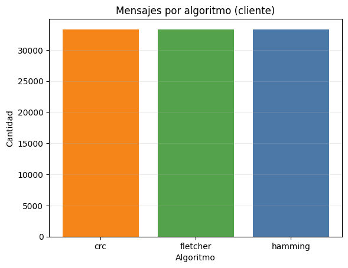
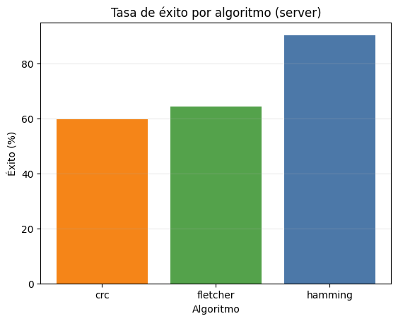
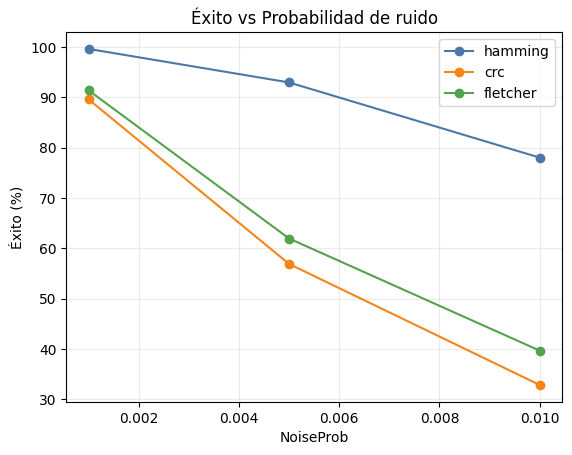
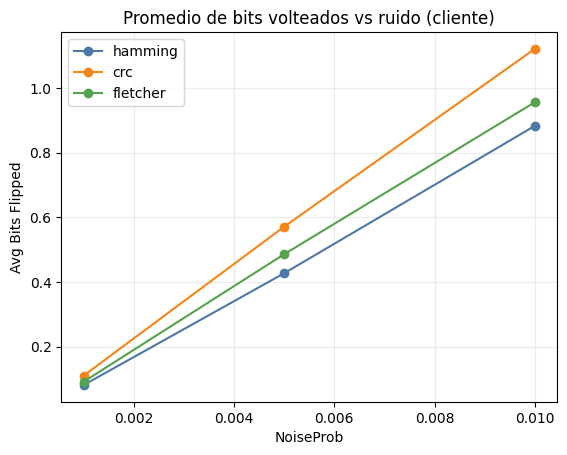
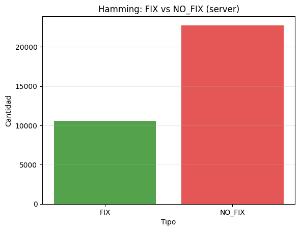

# Reporte de Pruebas

- Mensajes (cliente): **99999**
- Registros (server): **99999**
- Fix detectados: **10587**
- Correcciones exitosas: **71433** (71.43%)

## Gráficas
- chart_client_msgs_per_algo.png
- chart_success_rate_per_algo.png
- chart_success_vs_noise.png
- chart_bits_flipped_vs_noise.png
- chart_hamming_fix_counts.png

