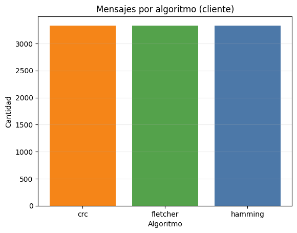
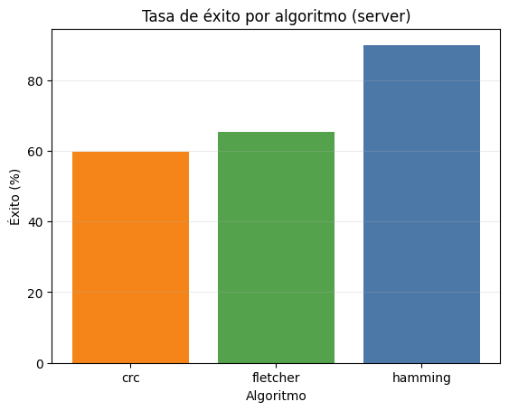
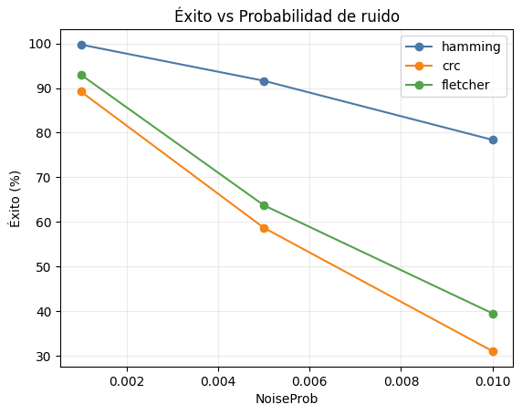
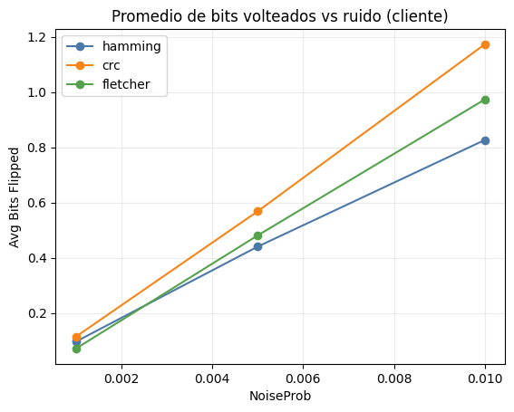
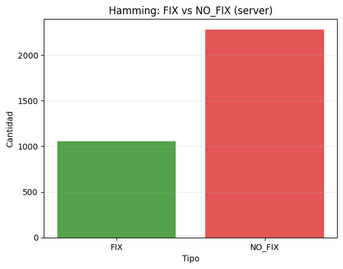

# Reporte de Pruebas

- Mensajes (cliente): **9999**
- Registros (server): **9999**
- Fix detectados: **1053**
- Correcciones exitosas: **7165** (71.66%)

## Gráficas
- chart_client_msgs_per_algo.png
- chart_success_rate_per_algo.png
- chart_success_vs_noise.png
- chart_bits_flipped_vs_noise.png
- chart_hamming_fix_counts.png

