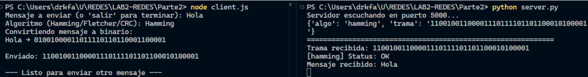

# Redes - Laboratorio 2: Esquemas de detección y corrección de errores

* Monica Salvatierra - 22249
* Derek Arreaga - 22537
* Paula Barillas - 22764

> [Enlace al repositorio](https://github.com/paulabaal12/LAB2-REDES)

## Parte 1

Para esta parte se implementaron algoritmos de detección y corrección, con el propósito de analizar el funcionamiento de cada uno, así como identificar las ventajas y desventajas de cada uno. En nuestro caso, escogimos un algoritmo de corrección de errores (**``Código de Hamming``**) y dos de detección de errores (**``Fletcher checksum``** y **``CRC-32``**). El objetivo era investigar y analizar cada algoritmo para determinar los mejores casos de uso para cada uno. Además, se decidió realizar el código para el emisor en ``JavaScript`` y para el receptor en ``Python``.

En esta parte se hicieron pruebas para 3 mensajes en binario distintos [(ver aquí)](Parte1/FletcherChecksum/tests), primero se realizaron las pruebas de `codificación` con dichos algoritmos y luego se hicieron pruebas de `decodificación` para los resultados anteriores. Por último se modificaron los mensajes para verificar que los algoritmos detecten los errores y en caso de **`Hamming`**, los corrija.

### Ejecución

Para cada algoritmo se programó un `encoder.js` y un `decoder.py`, para la ejecución de ambos se debe de hacer lo siguiente desde la carpeta raíz:
```bash
cd Parte1/<Algoritmo deseado>
```
Para el **`encoder`**:

```bash
node encoder.js in/msg1.txt in/msg2.txt in/msg3.txt
```
De este modo se generarán los mensajes encodeados en la carpeta [/out](Parte1/FletcherChecksum/out) de dicho algoritmo.

Para el **`decoder`**:
```python
python decoder.py out/msg1_fletcher16.txt out/msg2_fletcher16.txt out/msg3_fletcher16.txt
```

Para este ejemplo se colocaron los archivos generados por el encoder de `Fletcher`, pero para desencriptar los mensajes de otros algoritmos, se debe de colocar la ruta correcta de los archivos.


## Parte 2

Para la segunda parte del laboratorio, se implementó un cliente (``Emisor``) y un servidor (``Receptor``) para el paso de mensajes con los **3** algoritmos implementados previamente. 
El cliente se realizó con **``JavaScript``** y el servidor con **``Python``**, la conexión se implementó con **Sockets** mediante **TCP**. Adicionalmente se simuló el **ruido** (como representación de interferencia de parte del ``Emisor``), para determinar cuál bit se volteaba, nos basamos en una probabilidad definida previamente.

### Ejecución normal

Para la ejecución de los programas, se debe de ejecutar en consolas separadas lo siguiente:

1. Dirigirse a la carpeta de la parte 2
    ```bash
    cd Parte2
    ```

2. Levantar el [server.py](Parte2/server.py)
    ```bash
    python server.py
    ```
    Ahora el servidor estará escuchando en el puerto determinado (**5000**)

3. Ejecutar el [client.js](Parte2/client.js)
    ```bash
    node client.js
    ```
4. Ingresar un mensaje y seleccionar el algoritmo deseado como en el ejemplo:
    

### Ejecución de tests
Para la ejecución de los tests, se debe de ejecutar parecido a antes pero con la diferencia de agregar la flag `--test`:

1. Dirigirse a la carpeta de la parte 2
    ```bash
    cd Parte2
    ```

2. Levantar el [server.py](Parte2/server.py)
    ```bash
    python server.py --test
    ```
    Ahora el servidor estará escuchando en el puerto determinado (**5000**)

3. Ejecutar el [client.js](Parte2/client.js)
    ```bash
    node client.js --test <NUM_DE_TEST_DESEADOS_>_10)>
    ```
4. Esperar a que termine la ejecución y al finalizar se generarán reportes basados en los mensajes enviados de distinto largo, con distintas probabilidades de ruido y mediante distintos algoritmos. [Ejemplo Aquí](Parte2/reports/out/20250818_013435_N100000)